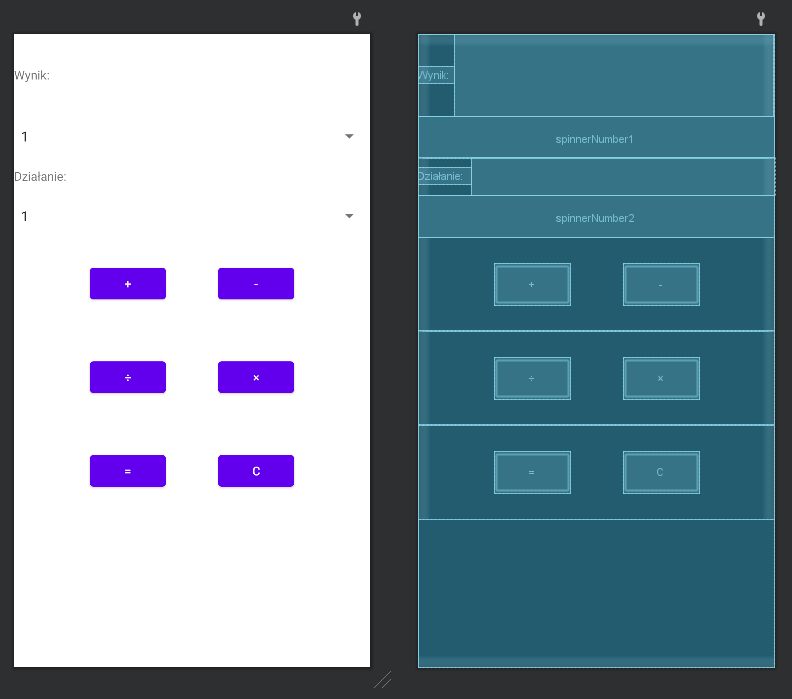

# Lab1 - Kalkulator

## Założenia aplikacji:
    - wybieramy dwie liczby (wpisane na sztywno w liście rozwyjanej typu Spinner)
    - otrzymanie wyniku po kliknięicu przycisku
    - użycia zasobów łańcuchowych i tablic
    - użycie elementów: Spinner, Button, Text View

## Widok aplikacji

__Wybór liczby - użycie Spinnera__

__Po wybraniu liczb i naciśnięciu przycisku "+", "-", "÷", "×" symbol wybranej operacji wyświetla się przy "Działanie:"__

__Po wybraniu "=" wykonane zostanie działanie, a wynik wyświetlony obok "Wynik:". Wynik operacji dodawania:__

__Odejmowanie:__

__Dzielenie:__

__Mnożenie:__

__Po kliknięciu "C" czyszczone jest pole wyniku oraz działania__

__Widok układu:__

__Przyciski "+", "-", "÷", "×" wywołują metodę "operationBtnOnClick" przy kliknięciu__

__Przycisk "=" wywołuje metodę "equalBtnOnClick", a "C" "clearBtnOnClick":__

__Użycie zasobów łańcuchowych i tablic:__

__"operationBtnOnClick" ustawia text w TextView działania na symbol klikniętego przycisku__

__"cleanBtnOnClick" zmienia wartość stringa przechowującego aktualną operację na pustą i czyści TextView wyniku oraz działania__

__"equalBtnOnClick" pobiera wartości z obu Spinnerów i parsuje je na double, potem w zależności od zmiennej globalnej "operation" wykonuje działanie. Sprawdza też czy nie występuje dzielenie przez 0. Wynik wypisuje w TextView__

