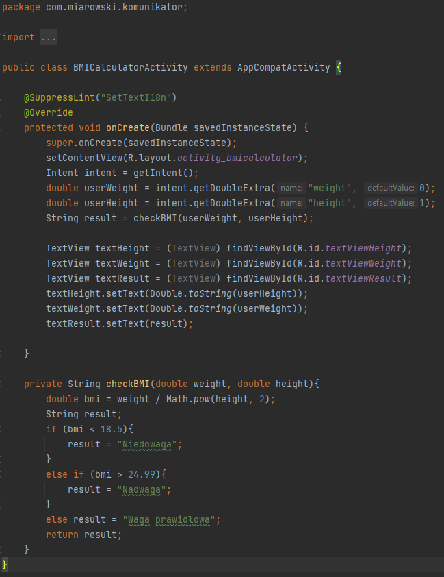

# Lab2 - Aktywności i intencje

## Założenia aplikacji:
    - utworzyć 3 aktywności
    - możliwość przechodzenia między aktywnościami
    - użycie metod putExtra(), getIntent oraz użycie akcji

## Opis:
    Odpalając apliakcję widzimy główną aktywność. Z niej mamy możliwość na przejście do dwóch pozostałych. Po wpisaniu imienia i kliknięciu górnego przycisku za pomocą akcji jesteśmy przekierowywani do aplikacji umożliwiającej wysłanie wiadomości. Wiadomość domyślna zawiera wprowadzone imię oraz tekst " życzy smacznej kawusi!". W przypadku kliknięcia przycisku bez wpisania imienia wyskoczy ostrzeżenie o braku imienia i zablokuje możliwość przejścia.

## Trzecia aktywność:
     to prosty kalkulator BMI. W głównej aktywności wprowadzamy wzrost oraz wagę i klikamy przycisk, by przejść dalej. W przypadku braku, któregoś z parametrów wyskakuje ostrzeżenie jak przy imieniu. Na podstawie wprowadzowanych danych w głównej aktywności, aktywność kalkulatora BMI oblicza współczynnik BMI korzystając ze wzoru BMI = Waga/Wzrost^2 i na jego podstawie podaje wynik zgodny z wartościami wpisanymi w tabele.

