# __Lab3 - Widoki i grupy widoków w różnych układach__

# ___AVATAR CREATOR - <y>sponge edition</y>___

## _Założenia aplikacji:_
    - utworzyć 2 aktywności- jedna z ConstraintLayout, druga z FrameLayout
    - przejścia pomiędzy aktywnościami przy pomocji intencji
    - użyć wielu różnych elementów
    - skorzystać jak najwięcej z zasobów

## _Opis:_
Aplikacja umożliwia stworzenie swojego avatara w trzech dostępnych wariantach "klasowych". Jest to <y>_sponge edition_</y> dlatego customowanym avatarem jest SpongeBob. Do wyboru są trzy klasy domyślne: Wojownik, Mag, Łucznik. Każda z klas posiada unikalne nakrycie głowy oraz broń. Istnieje jednak możliwość utworzenia własnej klasy, a broń oraz nakrycie głowy można zaczerpnąć z klas domyślnych.

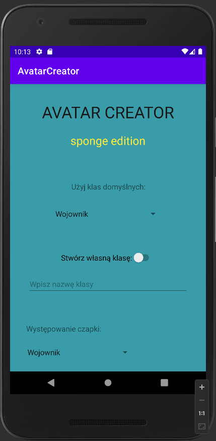

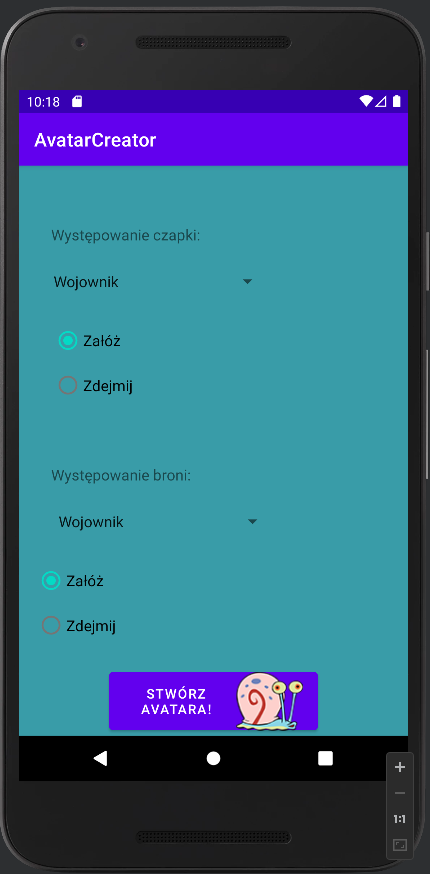

## _Pierwsza aktywność:_
Cała aktywność zawarta jest w ConsttraintLayout, który zagnieżdżony jest w ScrollView.
User ma możliwość wyboru predefiniowanej klasy dostępnej przy wykorzystaniu spinnera:

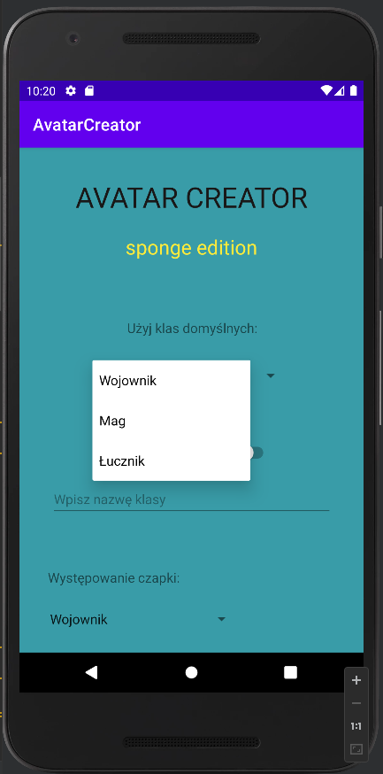

Po zjechaniu na sam dół widać button, który zawiera obrazek Gacusia. Po jego kliknięciu tworzona jest druga aktywność.

User ma jednak możliwość utworzenia też swojej klasy. Aby to zrobić pierw musi użyć switcha, którym sygnalizuje korzystanie z własnej klasy. Wybraną nazwę wpisuje w pole EditText. Następnie wybiera czy jego Avatar ma nosić czapkę czy też nie. To samo z bronią. Jeżeli zdecyduje się na założenie ich wybrać musi, z której domyślnej klasy item bierze.

Metoda uruchamiana przy kliknięciu Gacusia:

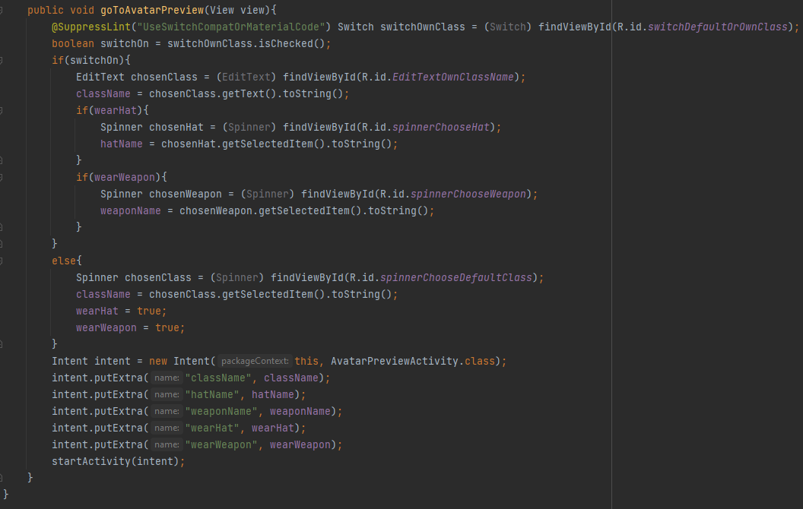

Jeżeli User stworzył własną klasę i wybrane zostały opcje noszenia itemów to pobierane są ich nazwy oraz nazwa utworzonej klasy. Jeżeli korzysta z klasy domyślnej nazwy itemów są domyślne czyli są równe "", a avatar będzie nosił broń i nakrycie. Wszystkie 5 informacji przekazywane jest do intencji, która uruchamia nową aktywność

## _Druga aktywność:_
W drugiej aktywności dostajemy obraz naszego avatara. Zastosowany jest tu FrameLayout. Sam avatar jest tak naprawdę nałożonymi na siebie czterema ImageView. Pierwszym z nich jest tło, które jest opcjonalne do wyświetlenia, a odpowiada za niego checkbox w lewym dolnym rogu. Następnie idą ImageView broni, bazy avatara czyli SpongeBoba oraz nakrycie głowy. 

Przykład wyświetlenia dla wybranej domyślnej klasy Wojownika:

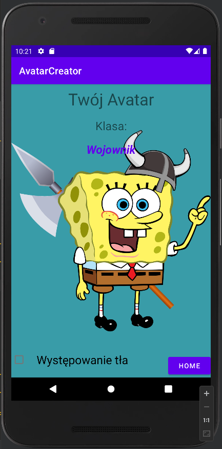

Przykład z własną klasą noszącą czapkę magika oraz broń łucznika:

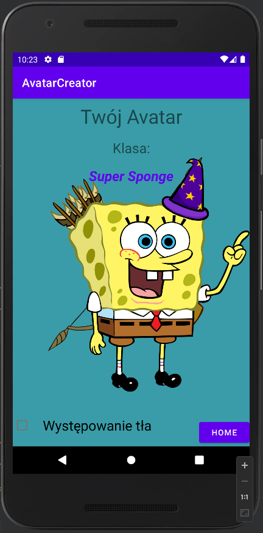

Oraz z opcją tła:

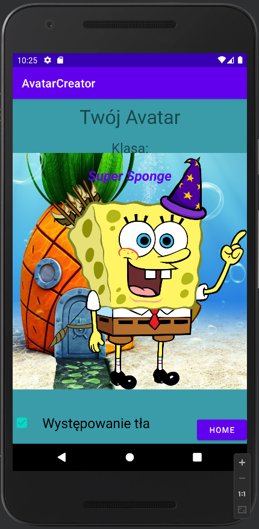

W prawym dolnym rogu znajduje się przycisk Home, który uruchamia funkcję finish() kończącą aktualną aktywność i przenoszącą do poprzedniej.

Metoda onCreate() drugiej aktywności:

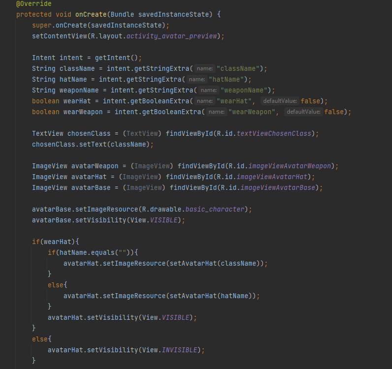

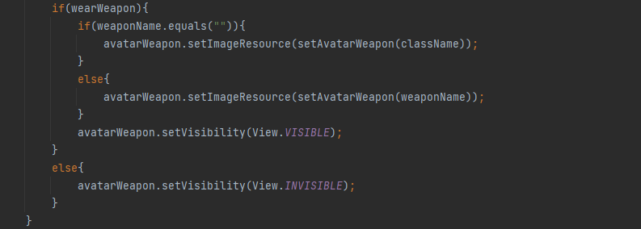

Metody pomocnicze:

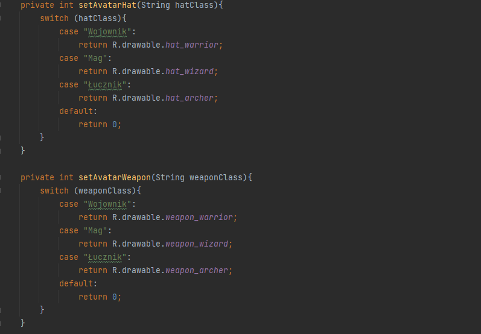

Po utworzeniu intencji i stworzeniu zmiennych sprawdzane jest czy postać coś nosi. Jeżeli nosi, a nazwa itemu jest równa "" oznacza, to że została wybrana klasa domyślna więc itemy wyszukiwane są po nazwie klasy. Jeżeli nazwy są inne oznacza to utworzenie własnej klasy, dlatego itemy szukane są po własnych nazwach klas.

W przypadku, gdy item nie jest noszony lub opcja z tłem nie została wybrana zmieniana jest widoczność danego ImageView na _INVISIBLE_ i odwrotnie w przypadku wybrania opcji.

W aplikacji wykorzystane zostały pliki string.xml oraz dimens.xml:

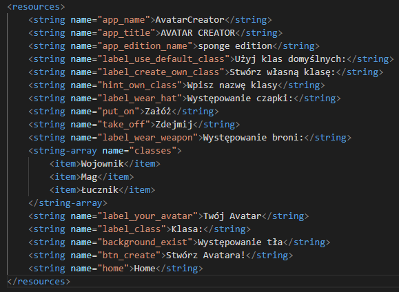

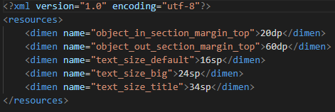

