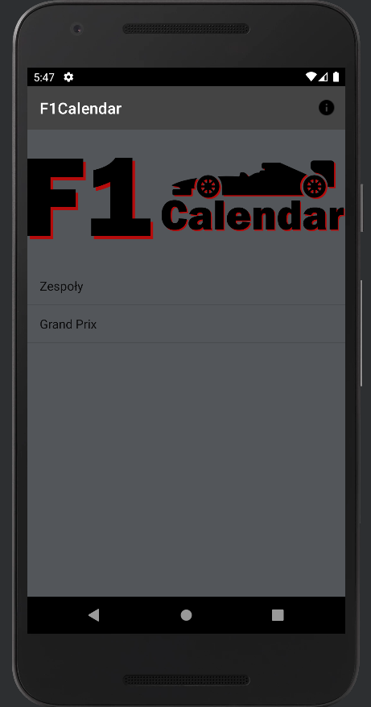
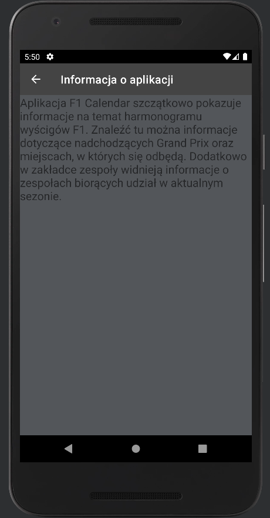
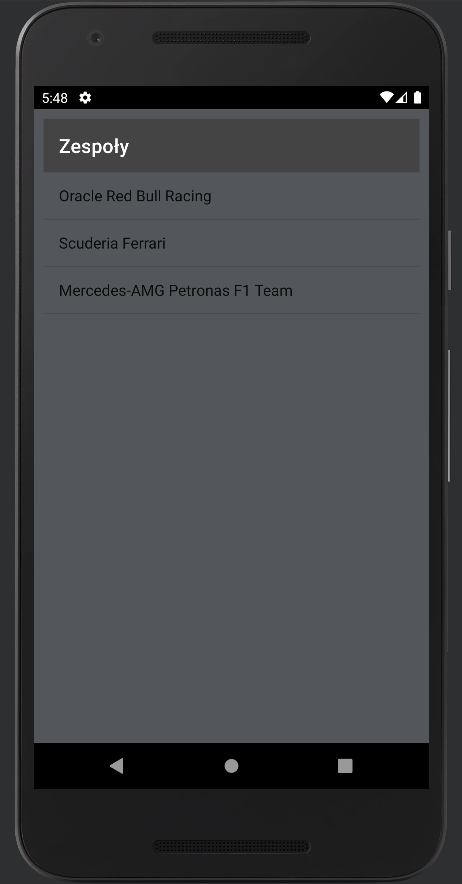
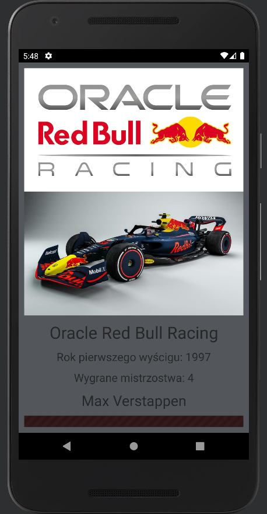
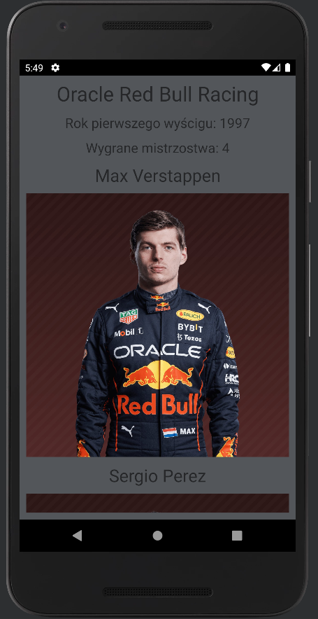
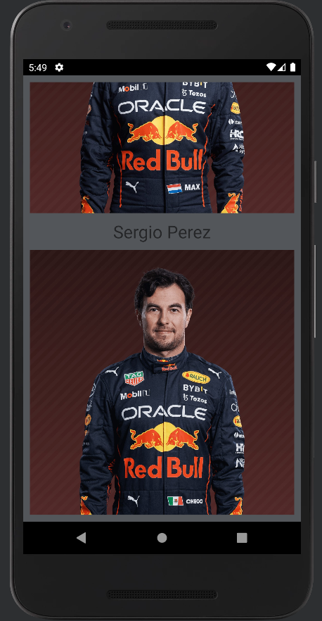
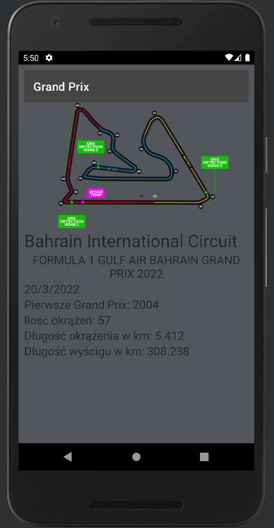

# __Lab4 - Widoki list, adaptery, paski aplikacji …__

# ___F1 Calendar___

## _Założenia aplikacji:_
    -  należy utworzyć aplikację co najmniej 3-poziomową (poziomy inne niż w ww. rozdziałach);
    - aktywność główna zawiera widok listy i dowolny obrazek (np. logo);
    - każda pozycja z listy po kliknięciu prowadzi do poziomu drugiego (aktywność kategorii),   zawierającego kolejny widok listy;
    - każda pozycja z listy po kliknięciu prowadzi do poziomu trzeciego (aktywność szczegółów), zawierającego informacje o danym elemencie (produkcie itp.);
    - utwórz klasę przechowującą informacje o elementach list;
    - dodaj pliki graficzne do zasobów;
    - zaimplementuj obiekt nasłuchujący (reagowanie na kliknięcia widoku);
    - użyj adaptera do pobrania danych statycznych;
    - usuń pasek aplikacji, dodaj pasek narzędzi i zmień wybrany motyw, pozmieniaj również odpowiednie kolory;
    - dla paska narzędzi utwórz osobny layout, w aktywności należy skorzystać z import android.support.v7.widget.Toolbar (androidx.appcompat.widget.Toolbar);
    - ww. pasek narzędzi należy dodać do każdej utworzonej aktywności (znacznik ‘include’ w plikach layoutu);
    - pamiętaj o metodzie setSupportActionBar();
    - utwórz aktywność InfoActivity, która powinna zawierać krótką informacje o aplikacji;
    - dla każdej aktywności dodaj w pliku manifestu label, który będzie wyświetlany na pasku narzędziowym;
    - w głównej aktywności dodaj akcję do paska narzędziowego (ikonka + tytuł akcji + plik zasobu menu);
    - w głównej aktywności dodaj menu do paska aplikacji w metodzie onCreateOptionsMenu();
    - w głównej aktywności dodaj reakcję na kliknięcia elementów akcji za pomocą metody onOptionsItemSelected();
    - dla InfoActivity ustaw aktywność nadrzędną w pliku manifestu - wybierz aktywność główną;
    - dla InfoActivity dodaj przycisk ‘w górę’ wykorzystując metody getSupportActionBar() i setDisplayHomeAsUpEnabled();

## _Opis:_
Aplikacja umożliwia podejrzenie zaplanowanych na aktualny sezon F1 Grand Prix. Po wybraniu danego wyścigu dostajemy szczegółowe informacje dotyczące toru, na którym się odbywa oraz grafikę reprezentującą go. Dodatkowo możemy podejrzeć informacje o zespołach. Znajdziemy tam np. grafike z logiem, bolid z aktualnego roku czy np. aktualnych kierowców ze zdjęciami. Aplikacja jest skróconą wersją i zawiera po 3 drużyny oraz 3 Grand Prix.

### _Widok główny:_

Na górze widzimy Toolbar, z którego możemy przejść do aktywności z informacją o aplikacji. Poniżej znajduje się duże logo oraz lista zakładek do wyboru.

### _Informacje o aplikacji:_

W tej aktywności widzimy krótką notkę informacyjną. Możemy wrócić do głównej aktywności poprzez naciśnięcie guzika "W górę".

### _Kategoria Zespoły:_

Po wybraniu w głównej aktywności "Zespoły" przechodzimy do widoku kategorii. Możemy wybrać tu zespół, który nas interesuje.

### _Zespół:_

Po wybraniu zespołu (w tym przypadku Oracle Red Bull Racing) widzimy na samej górze logo zespołu. Następnie tegoroczny bolid oraz następujące informacje: pełna nazwa zespołu, rok debiutu, ilość wygranych mistrzostw. Poniżej widzimy imiona oraz nazwiska wraz ze zdjęciami aktualnych kierowców zespołu.

### _Kategoria Grand Prix:_

Tak jak w przypadku kategorii zespołów widzimy listę tegorocznych Grand Prix. Po kliknięciu w dany przechodzimy do aktywności ze szczegółowymi informacjami na jego temat.

### _Grand Prix:_

Dla przykładu po wejściu w Grand Prix Bahrainu pierwsze co nam się wyświetla jest schemat toru z zaznaczonymi sektorami, strefami DRS oraz ponumerowanymi zakrętami. Poniżej znajdują się następujące informacje: pełna nazwa toru, pełna nazwa Grand Prix, data tegorocznego wyścigu, rok pierwszego Grand Prix na tym torze, ilość okrążeń do przejechania, długość okrążenia w km oraz długość całego wyścigu w km.