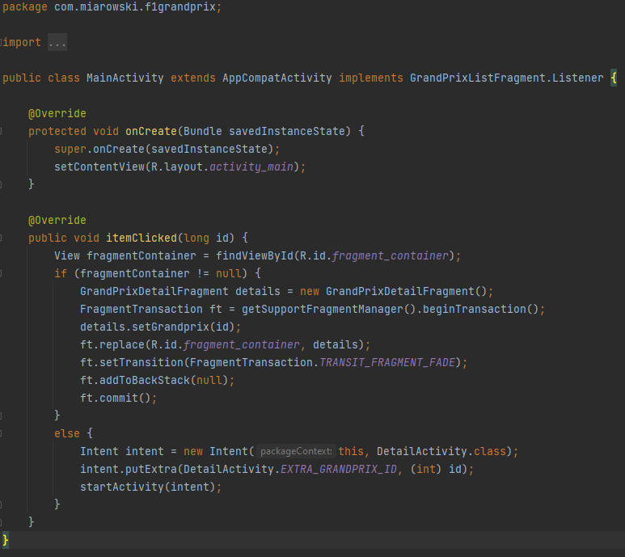

# __Lab5 - Fragmenty__

# ___F1 Grand Prix___

## _Opis:_
Aplikacja umożliwia podejrzeć dostępne Grand Prix F1 oraz sprawdzić ich okrojone szczegóły. Rozmieszczenie elementów zależy od wielkości ekranu, z którego się korzysta.

### _Widok główny na telefonie:_

Po wejściu do aplikacji widać listę dostępnych do wyboru torów. Po kliknięciu na wybrany przechodzimy do nowej aktywności pokazującej szczegóły:

### _Widok główny na tablecie:

Wybierając tablet wszystkie interesujące nas informacje pojawiają sie od razu na ekranie, nie ma tu dodatkowej aktywności

### _MainActivity_:

Odpowiada ona głównie za mechanizm reagowania na wybory dokonane przez użytkownika na głównym ekranie

### _DetailActivity_:

Odpowiada za drugą aktywność uruchamianą jeżeli korzysta się z mniejszego ekranu. Korzysta ona z klasy GrandPrix.java

### _GrandPrix.java_:

To ona dostarcza szczegółowych informacji o każdym z torów

### _GrandPrixListFragment_:

Fragment ten jest listą, którą user widzi na głównym ekranie. Wyświetla wszystkie dostępne obiekty klasy GrandPrix oraz reaguje na wybór

### _GrandPrixDetailFragment_:

Fragment ten pokazuje szczegółowe informacje na temat wybranego toru. W przypadku mniejszych wyświetlaczy jest on używany w dodatkowej aktywności. W przypadku większych wyświetlany jest w głównej aktywności zaraz obok listy