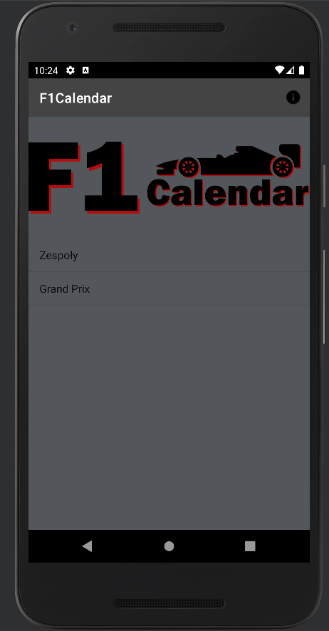
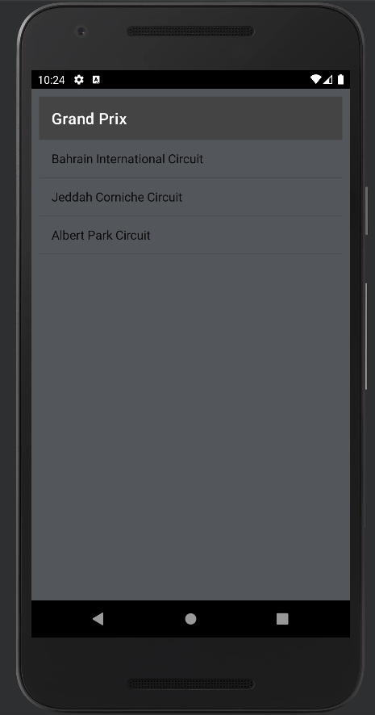
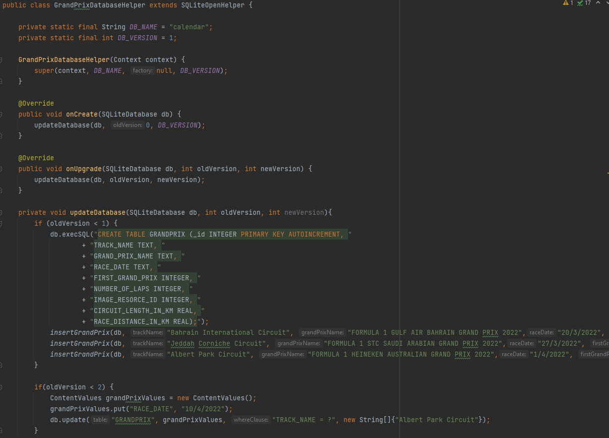
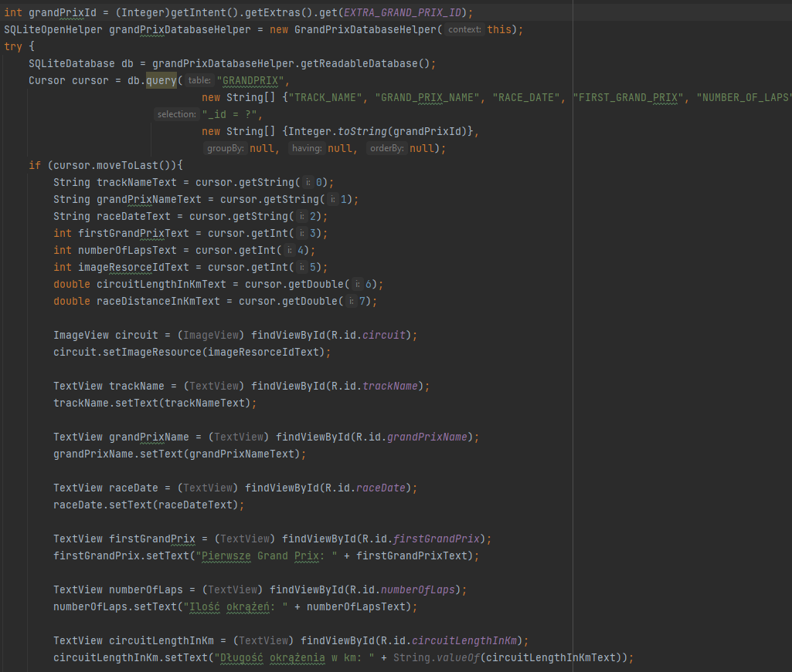

# __Lab6 - Baza danych SQLite i kursory__

# ___F1 Calendar___

## _Założenia aplikacji:_
    - należy rozwinąć lub zmodyfikować apki z innych zadań, tak by dane pobierane były z bazy danych zamiast z plików;
    - należy utworzyć bazę danych SQLite do przechowywania ww. danych;
    - skorzystaj z klasy SQLiteOpenHelper() do tworzenia i utrzymania ww. bazy,
    pamiętaj o metodach onCreate() i onUpgrade(), ewentualnie onDowngrade(),
    - skorzystaj z obiektu typu Cursor() i metody query() do tworzenia zapytań,
    - wykorzystaj co najmniej dwa różne zapytania w aplikacji,
    - skorzystaj z wybranych metod poruszania się po kursorze: moveToFirst(), moveToLast(), moveToPrevious(), moveToNext().

## _Opis:_
Kopia aplikacji z Lab4. Sekcja Grand Prix używa bazy danych zamiast pliku .java

## _Widok główny:_

## _Po kliknięciu Grand Prix:_

## _Po kliknięciu Bahrain International Circuit:_

## _GrandPrixDatabaseHelper.java:_

Jest to klasa dziedzicząca po SQLiteOpenHelper. Odpowiada ona za tworzenie bazy danych oraz modyfikacji jej. Do tworzenia tabeli oraz modyfikacji używana jest metoda updateDatabase, która tworzy nową tabelę i wstawia do niej dane lub modyfikuje już istniejące w zależności od wersji bazy jaką posiadamy.

## _GrandPrixDatabaseHelper.java:_

Za dodanie nowych elementów do tablicy odpowiedzialna jest metoda insertGrandPrix.

## _GrandPrixActivity.java:_

Zmodyfikowana klasa dzięki, której możemy podejrzeć szczegóły konkretnego GrandPrix. Użyty został obiekt klasy Cursor do pobierania danych z bazy. Następnie dane przechowywane w tym obiekcie pokazywane są na elementach wizualnych aktywności.

## _GrandPrixCategoryActivity.java:_

Zmodyfikowana klasa umożliwiająca wybór konkretnego GrandPrix w celu zobaczenia szczegółowych o nim informacji. Obiekt klasy Cursor pobiera z bazy nazwy torów, a następnie przy wykorzystaniu SimpleCursorAdaptera lista pobranych nazw pokazywana jest na ekranie użytkownika jako lista do wyboru.
