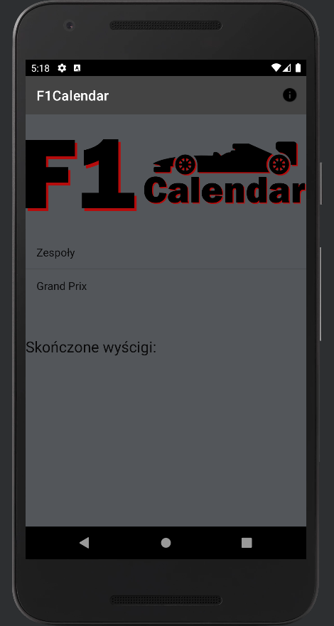
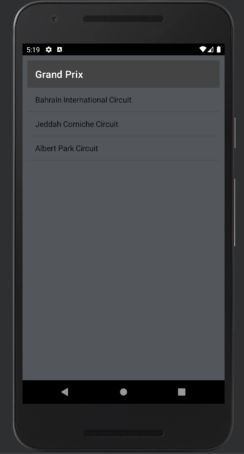
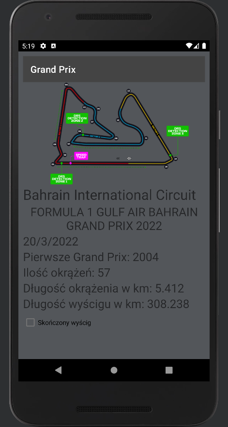
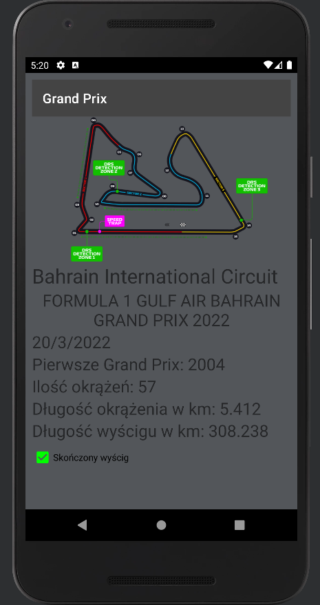
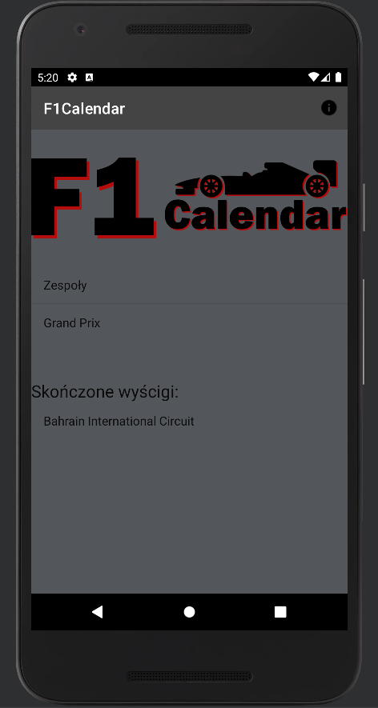
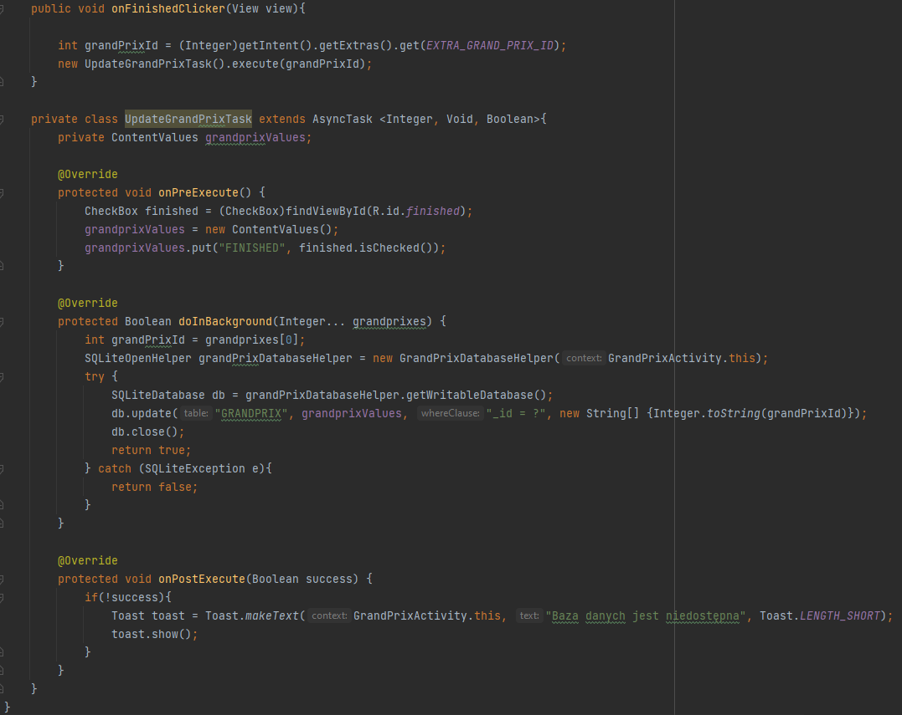
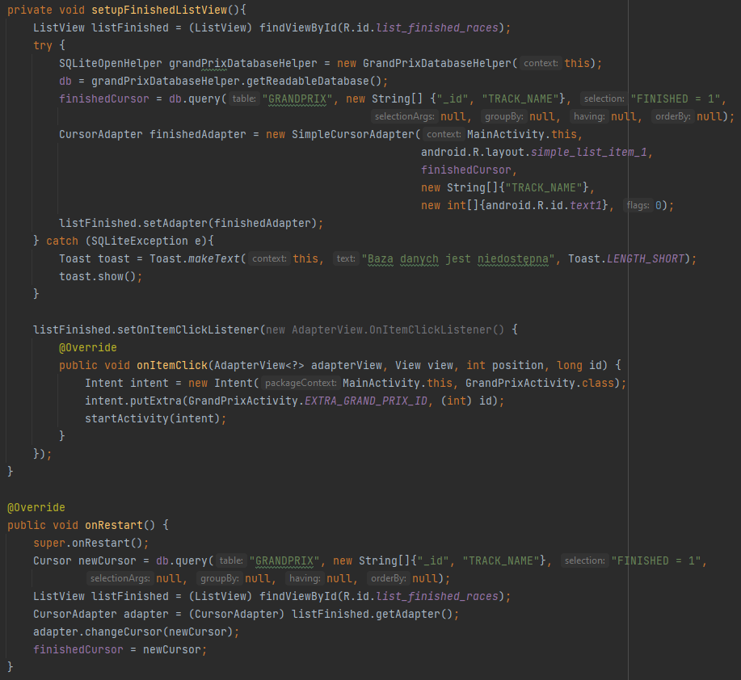

# __Lab7 - Zadania asynchroniczne__

# ___F1 Calendar___

## _Założenia aplikacji:_
    - przeanalizuj rodzaje wątków w aplikacjach na Androida,
    - wykorzystaj klasę AsyncTask do obsługi kodu, korzystającego z bazy danych, umieszczając go w osobnym wątku,
    - zaimplementuj metody onPreExecute(), doInBackground(), onPostExecute() oraz onProgressUpdate(),
    - pamiętaj o parametrach Params, Progress oraz Results klasy AsyncTask,

## _Opis:_
Zmodyfikowana aplikacja z Lab6. Użytkownik dodatkowo po wejściu w konkretne Grand Prix ma możliwość kliknięcia checkboxa informującego, że wyścig się już odbył. W głównej aktywności znajduje się lista nazw Grand Prix, które się już odbyły. Po kliknięciu na konkretny użytkownik przechodzi bezpośrednio do szczegółów wyścigu.

## _Widok główny:_

## _Po kliknięciu Grand Prix:_

## _Po kliknięciu Bahrain International Circuit:_

## _Po kliknięciu CheckBoxa:_

## _Po powrocie na główną aktywność:_

Jak widać po zaznaczeniu, że wyścig się już zakończył na głównym ekranie aplikacji pojawia się jego nazwa w zakładce "Skończone wyścigi".

## _GrandPrixActivity.java:_

Wykorzystanie klasy AsyncTask oraz metod onPreExecute(), doInBackground() oraz onPostExecute().

## _MainActivity.java:_

Kod odpowiedzialny za tworzenie widoku listy zakończonych Grand Prix w Main Activity oraz aktualizacja jej po restarcie.
